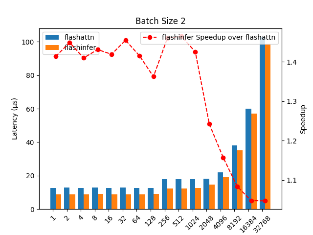
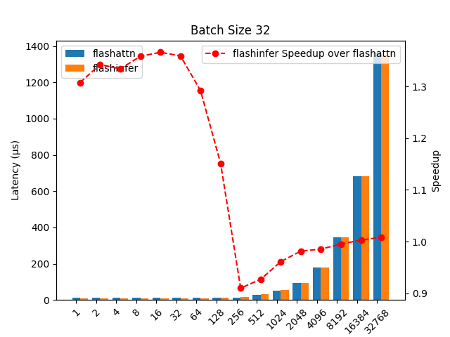

# flash-attention 2.6.2 vs flashinfer 0.1.6

```
python bench_attn.py --backend all --seq-len 1 2 4 8 16 32 64 128 256 512 1024 2048 4096 8192 16384 32768 --batch-size 1 2 4 8 16 32 64 128 256 --dump-csv
```
with the other defaults, i.e., `dtype==float16, head_size==128, num_query_heads==64, num_kv_heads==8, block_size==16, NUM_BLOCKS==32768, and device==cuda.`

## CSV
[flashattn2.6.2_vs_flashinfer0.1.6.csv](./flashattn2.6.2_vs_flashinfer0.1.6.csv)

### Batch Size 1:


### Batch Size 2:


### Batch Size 4:


### Batch Size 8:


### Batch Size 16:


### Batch Size 32:


### Batch Size 64:


### Batch Size 128:


### Batch Size 256:
